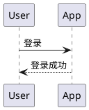

# 惚恍

个人站点，主导航包含首页、音乐、知识笔记、惚恍和 AI。主站部署在 GitHub Pages：<https://mesiphy.github.io/>，支持通过 Cloudflare Workers Static Assets 同步发布备用入口。

用 Astro 构建，纯静态输出，零客户端框架。首页展示整屏插画，音乐与三个文章栏目入口统一放在顶部导航；音乐使用粉色湖畔插画，知识笔记使用复古纸张背景，其余内容沿用水彩纸面，全站内容使用中文衬线字体。音乐使用网易云官方播放器，感想独立保存在 Markdown 中。

## 本地开发

```bash
npm install     # 首次
npm run dev     # http://localhost:4321
npm run build   # 构建 + 生成搜索索引到 dist/
npm run preview # 预览 dist/ 的构建产物
npm run check   # TypeScript / Astro 类型检查
npm test        # 草稿过滤、专辑引用、排序与播放器地址的回归测试
```

搜索索引由 Pagefind 在 `astro build` 之后生成，所以 **搜索功能只在 `build` + `preview` 下可用，`dev` 下是空的**。这是预期行为，不是 bug。

## 日常更新速查

往固定位置放文件，然后提交；音乐和文章沿用同一套 Git 发布流程。

| 要做什么 | 放哪 | 命名 |
| --- | --- | --- |
| 加一篇文章 | `content/posts/` | `小写英文-连字符.md`，文件名即 URL |
| 加一张专辑 | `content/albums/` | `小写英文-连字符.md`，文件名即专辑标识 |
| 加一首歌或修改感想 | `content/music/` | `小写英文-连字符.md`，正文就是感想 |
| 换首页背景 | `public/home/` | 图片路径与裁切位置在 `src/home.config.ts` 配置 |
| 换音乐栏目背景 | `src/assets/backgrounds/music-scene.png` | 覆盖同名图片，构建时自动转成 WebP |
| 换知识笔记背景 | `src/assets/backgrounds/knowledge-paper.png` | 覆盖同名图片，构建时自动转成 WebP |
| 换某栏目的脉络图 | `src/assets/graph/` | `knowledge-graph-<栏目slug>.png` |
| 加图片、附件 | `public/` | 原样拷到站点根目录，正文里写 `/图片名.png` |

```bash
git add -A && git commit -m "post: 新文章标题" && git push
```

push 到 `main` 之后 GitHub Actions 自动构建部署；接入 Cloudflare Git 集成后，Cloudflare 也会独立构建并发布同一份源码。**本地不需要跑 build**，但建议先 `npm run check` 拦一下 frontmatter 写错。

## 目录结构

```
content/posts/          文章源文件（纯 Markdown，刻意放在 src/ 外，方便整体迁移）
content/albums/         专辑元数据和介绍
content/music/          单曲元数据和感想
public/                 直接拷贝到站点根目录的静态资源（robots.txt、正文里引用的图片等）
src/
  assets/backgrounds/   阅读背景与标题笔刷；music-scene.png / knowledge-paper.png 为音乐 / 知识笔记背景
  assets/graph/         知识脉络图（走 Astro 资源管线，会被自动压缩）
  consts.ts             站点标题、分类登记表、导航、每页条数、脉络图配置
  content.config.ts     frontmatter 的 schema 校验
  home.config.ts        首页背景路径、桌面/手机裁切位置
  lib/posts.ts          文章读取、排序、分组、日期与阅读时间格式化
  lib/graph.ts          构建时解析脉络图文件（按栏目 slug 匹配，读取修改时间）
  components/           Header / Footer / PostCard / KnowledgeGraph / TableOfContents 等
  layouts/              BaseLayout（通用外壳）、PostLayout（文章页 + 侧边目录）
  pages/                路由。文件路径即 URL
  styles/global.css     设计系统：色板、字体栈、排版、代码块
.github/workflows/      GitHub Actions 自动部署
wrangler.jsonc          Cloudflare Workers 静态托管配置
```

`public/` 和 `src/assets/` 的区别：`public/` 原样拷贝、路径可预测，适合正文里 `` 引用的图；`src/assets/` 中通过 Astro 图片 API 使用的资源会被压缩、转 WebP。脉络图通过图片组件生成 srcset 和宽高；音乐和知识笔记背景通过 `getImage` 生成供 CSS 使用的图片地址。

## 栏目、导航与首页背景

- `/`：图片首页，仅保留顶部导航、背景与页脚，中央不展示站名、引文或重复入口。`public/home/background-left.webp` 来自用户提供的「网站背景左侧版本.png」；桌面和手机共用这张图，手机裁切位置偏向左侧，保留画面中的人物。
- `/music/`：专辑、曲目搜索和风格筛选。专辑详情位于 `/music/albums/<id>/`，单曲与感想位于 `/music/<id>/`。
- `/knowledge/`：知识笔记，读书、学习、通用技术与工具实践。
- `/huhuang/`：惚恍，个人感悟、情绪、自我理解与尚未成形的思考。
- `/ai/`：AI，容纳 AI 学习、辅助编程、产品方法与项目实践；`#projects` 是逸扉面板和 LearnBranch 的项目入口，项目详情地址保持不变。
- 栏目页展示简介、已发布文章数量和按日期倒序排列的全部文章，不分页。开发环境另外显示草稿及草稿数量；文章上下篇限定在同一栏目。
- 内容辅助导航为“全部文章 · 脉络 · 归档 · 标签 · 搜索”。文章页高亮所属栏目，项目详情页高亮 AI；公共内容工具页不高亮具体栏目。

旧入口通过 Astro 生成带 canonical 和 noindex 的静态跳转页，兼容 GitHub Pages 和 Cloudflare：

| 旧地址 | 新地址 |
| --- | --- |
| `/writing/` | `/posts/` |
| `/categories/knowledge/` | `/knowledge/` |
| `/categories/tech/` | `/posts/`（原文章已拆入知识笔记与 AI） |
| `/categories/ai-product/` | `/ai/` |
| `/categories/huxi-huangxi/` | `/huhuang/` |
| `/projects/` | `/ai/#projects` |

文章地址仍为 `/posts/<id>/`。归档、标签、搜索、脉络与 RSS 地址不变；旧入口不加入站点地图。

替换首页图片时，把文件放到 `public/home/`，修改 `src/home.config.ts` 的 `desktopImage` 与 `mobileImage`。`desktopPosition` 和 `mobilePosition` 接受 CSS `object-position`（如 `50% 35%`）。首页固定使用该图片，不受文章的亮暗主题影响。

替换音乐栏目背景时，覆盖 `src/assets/backgrounds/music-scene.png` 即可。当前原图来自「音乐背景图.png」，`BaseLayout.astro` 将它应用到 `/music/` 下的栏目首页、专辑和单曲页，并在构建时转为 WebP。遮罩由 `src/styles/music.css` 中的 `body[data-section='music']` 控制：亮色模式提亮，暗色模式压暗。背景固定在视口，居中、等比铺满，手机端保留中央人物，左右两侧随屏幕比例裁切。替换后运行 `npm run dev` 本地预览；提交并推送到 `main` 后自动部署。

替换知识笔记背景时，覆盖 `src/assets/backgrounds/knowledge-paper.png` 即可。当前原图来自「文字背景.png」，`BaseLayout.astro` 根据 `currentCategory` 将它应用到 `/knowledge/` 及该栏目的文章详情，并在构建时转为 WebP。`src/styles/global.css` 中的 `body[data-category='knowledge']` 控制遮罩：亮色模式稍微提亮，暗色模式压暗以保持文字清晰。背景固定在视口中，桌面和手机均居中、等比铺满，边缘会随屏幕比例裁切。替换后运行 `npm run dev` 本地预览；提交并推送到 `main` 后自动部署。

## 发布音乐与编辑感想

可以复制 `content/albums/example-album.md` 和 `content/music/example-track-one.md`；这些模板都是草稿，仅 `npm run dev` 可见，生产构建不会生成它们的页面。复制后使用新的小写英文文件名，替换占位 ID、正文和作者，再设置 `draft: false`。专辑也必须设为非草稿。

专辑示例（`content/albums/my-album.md`）：

```markdown
---
title: 我的专辑
date: 2026-09-22
description: 一句话介绍这张专辑。
cover: /music/my-album.webp
draft: true
---

专辑的创作背景或收录说明。
```

单曲示例（`content/music/my-song.md`）：

```markdown
---
title: 我的曲目
artist: 作者署名
album: my-album
trackNumber: 1
date: 2026-09-22
tags: [钢琴, 氛围]
neteaseId: '替换为真实歌曲ID'
embed: false
noteType: 创作感想
description: 显示在曲目列表和搜索结果中的感想摘要。
draft: true
---

在这里写完整感想，支持标题、段落、图片和引用。
```

- `date` 为本站收录日期；知道发行日期时填写可选的 `released: YYYY-MM-DD`。按发行日期排序，未填写时用收录日期；页面会明确区分“发行于”和“收录于”。未知发行日期不要猜测。
- `album` 必须是已存在的专辑文件名，不带 `.md`。`trackNumber` 是本站专辑内的展示顺序，正整数且同专辑不能重复。站内选录不等于平台完整专辑。
- `neteaseId` 必须用引号包围，填写链接 `song?id=` 后的数字。专辑可另外填写自己的可选 `neteaseId`，生成平台专辑入口。
- `noteType` 可填“创作感想”或“听后感”，默认前者。提供的《寂寞烟火（0.8x）》保留网易云署名“泡泡”，文字为听后感初稿，不冒称本站作者的原创作品。
- `cover` 可省略；单曲默认使用专辑封面。支持站内根路径与 HTTPS 图片地址，加载失败显示文字封面。推荐把自己的封面放到 `public/music/`。
- `updated: YYYY-MM-DD` 用于显著修订后的日期；摘要要同步修改 `description`。
- `embed` 默认 `false`，此时只显示网易云收听入口；确认目标歌曲可嵌入后再开启。首页和专辑页只在点击“试听”时加载一个共享播放器；单曲详情提供播放器。`auto=0` 不自动播放，切歌或关闭会销毁旧播放器，跳转页面会停止播放。
- 平台播放器受歌曲状态、网络和浏览器限制；网页无法可靠读取跨域 iframe 内部的播放结果，因此始终保留网易云链接。不会抓取音频，也不会绕过平台限制。
- 首次收录的《寂寞烟火（0.8x）》在当前浏览器验证中未呈现网易云播放器，因此暂设 `embed: false`。在自己的浏览器确认该歌曲支持官方外链后，可改为 `true`；站内试听组件已实现。
- 全文搜索收录已发布的歌曲信息与感想。草稿曲目、草稿专辑及其全部曲目从生产路由与搜索中排除；RSS 继续只订阅原有文章。

发布前依次运行 `npm test`、`npm run check`、`npm run build`，再用 `npm run preview` 检查搜索和播放器。感想更新同样通过提交、构建发布，不需要数据库或登录后台。

## 写一篇新文章

在 `content/posts/` 下新建 `.md` 文件。**文件名就是 URL**，所以用小写英文加连字符，不要用中文或空格。

```markdown
---
title: 文章标题
date: 2026-08-04
description: 一两句话说清这篇讲什么。会出现在列表页、搜索结果和分享卡片里。
category: 知识笔记
tags: [Git, 工程实践]
draft: false
---

正文从这里开始。
```

frontmatter 字段说明：

| 字段 | 必填 | 说明 |
| --- | --- | --- |
| `title` | 是 | 文章标题 |
| `date` | 是 | 发布日期，`YYYY-MM-DD` |
| `description` | 是 | 摘要，用于列表页和 SEO |
| `category` | 是 | 必须是 `知识笔记` / `惚恍` / `AI` 之一，写错构建会直接失败 |
| `tags` | 否 | 数组，自由添加，默认空 |
| `draft` | 否 | `true` 时只在 `npm run dev` 可见，不会发布到线上 |
| `updated` | 否 | 显著修订后填写，会在文章页显示"最后修订于" |

每篇文章只有一个主栏目，按主要讨论的问题归类；标签用于交叉主题，使用 AI 辅助创作本身不决定栏目归属。通用产品方法和 AI 产品项目归 AI，Git、建站与读书笔记归知识笔记，情绪和自我理解归惚恍。

分类是刻意受限的：schema 从 `src/consts.ts` 的登记表生成，拼错分类名构建会报错。新增栏目需登记 `CATEGORIES` 的 `name`、`slug`、`href` 和 `description`，其中 `href` 为 `/<slug>/`；栏目页与主导航由该配置生成。

`draft: true` 的文章不会出现在构建后的站点，包括列表、归档、标签、RSS 和搜索索引；公开 Git 仓库中的源文件仍然可见，草稿标记不是隐私保护。

正文里引用图片：把图放进 `public/`，然后写 ``，路径以 `/` 开头。

### 文本图表

站点会把带语言标记的图表代码块渲染成 SVG，并在图下保留可折叠、可复制的源码。例如：

````markdown

````

常用标记包括 `plantuml` / `puml` / `uml`、`mermaid`、`graphviz` / `dot`、`d2`、`vega` / `vega-lite`、`wavedrom` 等。语言标记后的文字会成为图注和图片替代文本。旧文章里标成 `text`、但内容以 `@startuml` 等 PlantUML 指令开头的代码块也会兼容渲染。

图表由 [Kroki](https://kroki.io/) 统一生成，默认服务地址是 `https://kroki.io`。如果希望图表源码不发送给公共服务，可以部署自己的 Kroki，并在构建时设置 `KROKI_BASE_URL`。

## 更新知识脉络图

每个栏目一张图，外部用生图模型画好后放进 `src/assets/graph/`，**按栏目 slug 命名**：

| 文件名 | 对应栏目 |
| --- | --- |
| `knowledge-graph-knowledge.png` | 知识笔记 |
| `knowledge-graph-huhuang.png` | 惚恍 |
| `knowledge-graph-ai.png` | AI |

换图就是**覆盖同名文件**，不需要改任何代码。`/graph/` 按三个栏目显示大图，栏目文章列表不展示脉络图。

- 扩展名不限：`png` / `jpg` / `jpeg` / `webp` / `avif` / `svg` 都认。同名多扩展名同时存在时的取用优先级见 `src/lib/graph.ts`
- 建议宽度 1600px 以上。Astro 会自动压缩、转 webp、生成多档 srcset，不必自己压
- 图下方的「更新于」日期取自**文件修改时间**，不用手填
- 缺哪张图，对应位置显示「脉络图待更新」，不会渲染碎图，也不影响构建；文件命名参考上表
- 新增栏目时会自动多出一个位子，文件名由 `CATEGORIES` 的 slug 推导

一个栏目一张而不是全站合成一张：栏目之间刻意互斥，本来就没有枝干可连，合成图只会让生图模型为了构图饱满而硬连几笔并不存在的边。

**注意**：脉络图放在 `src/assets/` 而不是 `public/`，所以换图后必须重新构建才生效（push 到 `main` 会自动构建）。这是换取自动压缩和防加载抖动的代价。

给生图模型的提示词可以参考：以某栏目的文章标题为节点，主题相近的连成枝干，树状布局，浅米色背景 `#f2ece0`、深色节点、细线枝干，留白充足。

## 部署

### GitHub Pages 主站

push 到 `main` 就会触发 `.github/workflows/deploy.yml`，跑 `npm ci` → `npm run check` → `npm test` → `npm run build`，然后发布到 GitHub Pages。仓库设置里 Pages 的 Source 需要选 **GitHub Actions**（不是 Deploy from a branch）。

`npm run check` 在部署流程里是一道闸：frontmatter 写错分类名、漏必填字段会在这里失败，而不是等到线上页面变成空白。所以部署失败先看 Actions 日志的这一步。

站点是用户站（仓库名 `mesiphy.github.io`），部署在域名根路径，所以 `astro.config.mjs` 里不需要配 `base`。如果将来改成项目仓库（比如 `/blog/`），必须同时设置 `base`，否则全站资源会 404。

### Cloudflare Workers 备用入口

使用 Workers Static Assets 直接托管 `dist/`，保持 Astro 纯静态输出，不需要 `@astrojs/cloudflare` 适配器、服务端入口或数据库。`wrangler.jsonc` 指定资源目录及 `404-page` 路由策略：不存在的地址返回现有 `404.html` 和 HTTP 404。

首次接入：

1. 登录 Cloudflare，进入 **Workers & Pages → Create application → Import a repository**。
2. 连接 GitHub，选择 `mesiphy/mesiphy.github.io`，按下表配置后保存并部署。
3. 首次部署成功后，在 Worker 的域名设置中确认并记录实际的 `workers.dev` 地址。

| 配置项 | 值 |
| --- | --- |
| Worker 名称 | `mesiphy-blog`，必须与 `wrangler.jsonc` 一致 |
| 生产分支 | `main` |
| 根目录 | 仓库根目录，留空或填 `.` |
| 构建变量 | `NODE_VERSION=24` |
| 构建变量 | `SKIP_DEPENDENCY_INSTALL=1` |
| 构建命令 | `npm ci && npm run check && npm run build` |
| 部署命令 | `npx wrangler deploy` |
| 非生产分支部署命令 | `npx wrangler versions upload`，用于预览 |

根目录不是本地外层的 `my-websites`，也不需要再填写 `mesiphy.github.io`。`SKIP_DEPENDENCY_INSTALL` 关闭自动安装，由构建命令中的 `npm ci` 严格按锁文件安装依赖。Wrangler 已作为开发依赖纳入锁文件。使用 Workers Builds 的默认部署凭据即可，无需在仓库中保存 API token。

**构建必须运行 `npm run build`**，不能只运行 `astro build`，否则会遗漏 `dist/pagefind/` 搜索索引。部署地址形如 `https://mesiphy-blog.<账户子域名>.workers.dev`，具体子域名以 Cloudflare 控制台为准。

接入后，每次更新 `main`，GitHub Actions 和 Cloudflare 各自构建并发布；非生产分支的预览部署不替换生产版本。若构建失败，查看对应平台的构建日志，修复后重试；如需回退 Cloudflare，使用控制台的部署回滚功能选择已验证的版本。

#### 本地验证

在仓库根目录使用 Node.js 24，依次运行（前一步成功后再继续）：

```bash
npm ci
npm run check
npm run build
npx wrangler deploy --dry-run
npx wrangler dev --ip 127.0.0.1 --port 8787
```

`--dry-run` 只检查部署配置，不发布网站；`wrangler dev` 在本地模拟 Workers 静态托管。打开 `http://127.0.0.1:8787/` 检查：

- 首页、文章详情、分类、中文标签、项目页可访问，直接刷新正常。
- `/search/` 搜索能返回结果，点击结果后仍在当前站点。
- 字体、图片正常加载，主题切换有效。
- 不存在的路径显示自定义 404 页面，并返回 HTTP 404。
- `/rss.xml`、`/sitemap-index.xml` 和 `/robots.txt` 可访问。

上线后在实际 `workers.dev` 地址重复上述检查，并核对两平台部署的 `main` 提交编号。

#### 主站地址约定

GitHub Pages 是主站，Cloudflare 是备用入口。canonical、Open Graph URL、RSS、sitemap、robots.txt 中的站点地图及项目结构化数据继续指向 `https://mesiphy.github.io`，站内导航和搜索结果使用现有站内路径。不要为备用入口改写 `site` 或自动使用预览域名作为 canonical。

部分文章图表通过浏览器请求 `kroki.io` 加载，增加 Cloudflare 部署不会消除这项外部依赖。使用自托管 Kroki 时，在两个平台的构建环境中配置相同的 `KROKI_BASE_URL`。

参考：[Astro 部署指南](https://docs.astro.build/en/guides/deploy/cloudflare/)、[Workers 构建配置](https://developers.cloudflare.com/workers/ci-cd/builds/configuration/)、[构建环境](https://developers.cloudflare.com/workers/ci-cd/builds/build-image/)。

## 换成自己的域名

1. 在 `public/` 下新建 `CNAME` 文件，内容是裸域名，例如 `example.com`
2. DNS 加解析：`A` 记录指向 GitHub Pages 的四个 IP，或用 `CNAME` 指向 `mesiphy.github.io`
3. 把 `src/consts.ts` 的 `SITE_URL` 和 `astro.config.mjs` 的 `site` 改成新域名，否则 sitemap、RSS 和 canonical 链接还指向旧地址
