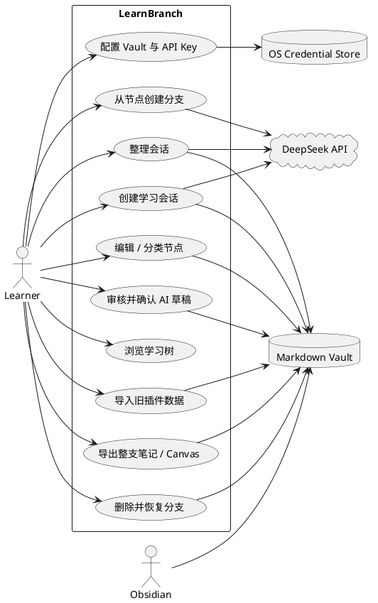
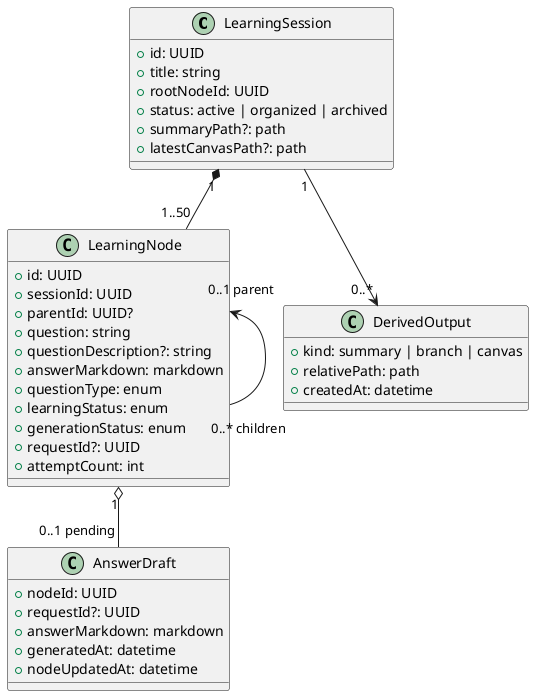
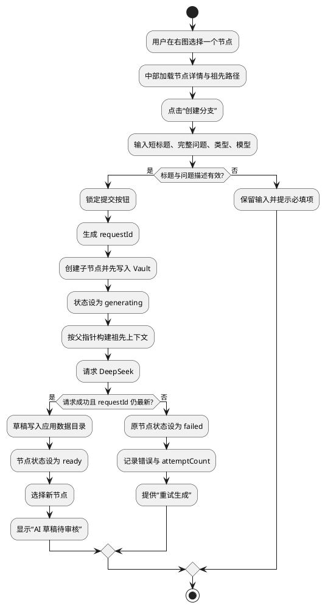
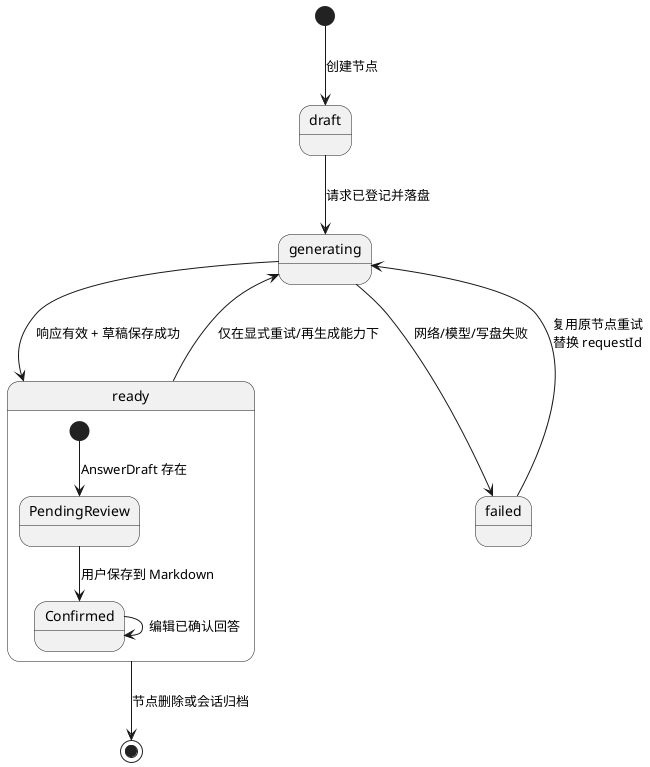
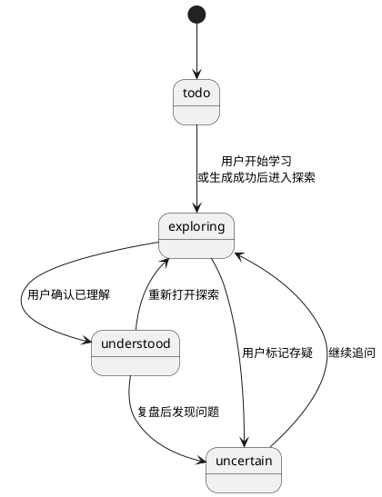
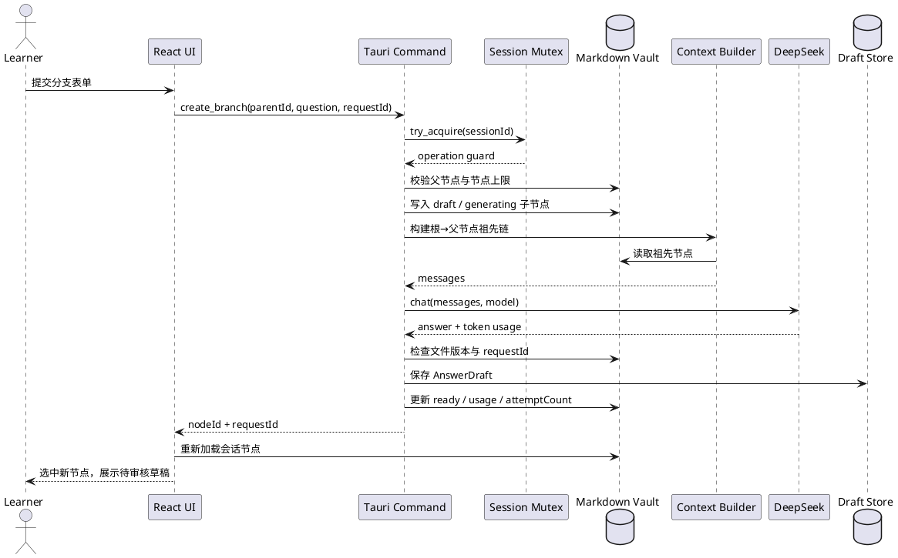
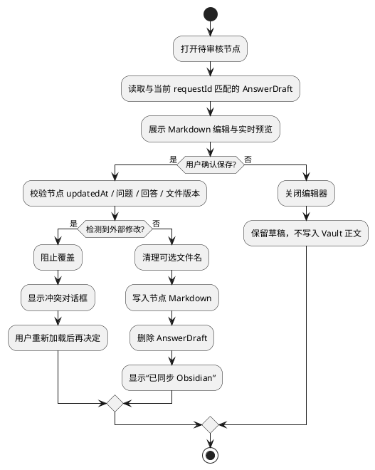

AI 产品最危险的交互文档，是只画一条“输入—生成—展示”的快乐路径。真实用户会重复点击、切换节点、关闭应用、在 Obsidian 中改文件，也会遇到断网、迟到响应和半完成删除。若这些状态没有被建模，工程实现只能在异常发生时临时猜测。

本文用 PlantUML 表达 LearnBranch 当前 Tauri 主线的用例、领域对象、活动、状态与时序。代码块本身就是可复制的 UML 源模型；随后再用产品岗位常用的交互矩阵、决策表和 Given-When-Then 验收补足界面细节。

## 一、系统边界与参与者

Learner 是唯一改变学习判断的人；DeepSeek 只提供生成结果；Vault 保存权威 Markdown；操作系统凭据库保存 API Key；Obsidian 是可选的外部阅读与编辑器，不是 LearnBranch 的运行前提。

边界里最重要的判断是：Obsidian 与 LearnBranch 都可能读写 Markdown，但它们不能静默覆盖彼此。外部编辑不是“同步成功”的同义词，而是下一次保存必须检查的版本变化。

## 二、领域类图：树、草稿和派生输出

类图暴露出三个业务约束：

1. Node 的自关联是单父结构，所以“上下文”可以稳定定义为祖先链。
2. Answer Draft 不等于 Node.answerMarkdown；前者存在时，界面必须显示待审核。
3. Derived Output 依赖源节点生成，但不拥有源节点，也不能反向改树。

## 三、核心活动图：从历史节点创建分支

这里“先写节点，再请求模型”是关键顺序。若先请求再创建节点，断网会让用户刚输入的问题一起消失；现在失败只是节点的一种状态，用户可以原位重试。

## 四、状态机：系统状态与用户判断必须分开

### 4.1 生成状态

`PendingReview` 是界面派生状态，不是磁盘里的第五个 `generationStatus`。它由“节点 ready 且存在匹配 requestId 的 Answer Draft”推导。这样既保持数据枚举简单，又能准确区分“模型生成完成”和“用户已经确认”。

### 4.2 学习状态

两张状态机不能合并。“生成失败”不代表“存疑”，“生成成功”也不代表“已理解”。前一张描述系统可靠性，后一张描述人的认知判断。

## 五、时序图：一次成功分支如何跨越 UI、Rust、API 与磁盘

若 AI 响应回来时磁盘里的 `requestId` 已被新请求替换，时序在“检查”处终止，旧响应不得进入 Draft Store 或覆盖 Node。这是防迟到响应的核心，而不是前端隐藏一个 loading 就能解决的问题。

## 六、审核草稿的活动与决策

产品文案要准确对应动作：“取消”只是退出编辑，不是丢弃草稿；“保存到 Obsidian”才是确认。若以后增加“放弃草稿”，它必须是单独的危险动作，并说明节点会保留什么内容。

## 七、页面交互矩阵

| 页面/区域 | 用户动作 | 立即反馈 | 持久化 | 失败后的落点 |
| --- | --- | --- | --- | --- |
| 会话列表 | 搜索 | 列表即时过滤 | 否 | 保留关键词 |
| 会话列表 | 选择会话 | 跳转详情、加载节点 | 最近会话设置 | 加载错误，不改数据 |
| 右侧图谱 | 单击节点 | 选中并更新中部详情、突出路径 | 否 | 维持原选择 |
| 右侧图谱 | 缩放/平移/适配 | 视口变化 | 否 | 不影响节点 |
| 节点详情 | 创建分支 | 按钮锁定、完成后选择新节点 | 是 | 原位 `failed`，可重试 |
| 节点详情 | 修改问题类型/学习状态 | 控件锁定后刷新值 | 是 | 回退显示并提示错误 |
| 草稿编辑器 | 关闭/取消 | 退出编辑器 | 草稿仍保留 | 不适用 |
| 草稿编辑器 | 保存 | 写入中、成功后关闭 | 是 | 保留编辑内容，提示冲突/错误 |
| 节点详情 | 导出整支 | 显示节点范围和文件名 | 新建派生 Markdown | 保留树，允许重试 |
| 节点详情 | 删除分支 | 显示后代数量与恢复位置 | 移入 trash | 回滚已移动文件或报错 |
| 图谱工具栏 | 整理会话 | 生成进度 | 新建版本化总结 | 无效结果进入失败区 |
| 图谱工具栏 | 导出 Canvas | 禁用重复提交 | 新建版本化 `.canvas` | 不更新 latestCanvasPath |
| 设置 | 旧数据导入 | 扫描预览、风险提示 | 备份后批量写入 | 回滚批次，源目录不变 |

这个矩阵的价值在于同时写出“即时反馈”和“是否落盘”。只描述页面跳转，工程师无法知道关闭弹窗究竟应该撤销什么；只描述接口，又无法知道用户看到的状态是否诚实。

## 八、异常决策表

| 条件 | 系统判断 | 用户提示 | 允许动作 | 禁止动作 |
| --- | --- | --- | --- | --- |
| AI 请求失败 | 节点 `failed` | 错误摘要、尝试次数 | 原节点重试 | 静默新建重复节点 |
| 响应 requestId 过期 | 有更新请求 | 新请求已替换旧响应 | 查看最新节点 | 旧响应覆盖 |
| 外部文件已修改 | 版本/快照不一致 | 检测到外部编辑 | 重新加载 | 强制保存覆盖 |
| 根节点请求删除 | `parentId = null` | 根节点不可删除 | 返回详情 | 调用子树删除 |
| 分支含后代 | `descendantCount > 0` | 明确总删除数量 | 确认后移入 trash | 不提示直接删除 |
| 草稿待审核 | AnswerDraft 存在 | 尚未写入 Obsidian | 编辑、确认 | 导出未确认内容为正式笔记 |
| 单会话达到 50 节点 | 达到上限 | 说明限制 | 整理、导出、删除 | 创建新分支 |
| 旧导入未知 Schema | 不可安全解释 | 阻断原因与路径 | 只读检查、退出 | 猜测字段并写入 |
| Canvas 写入失败 | 派生操作失败 | 保留旧快照 | 再次导出 | 更新 latestCanvasPath |

## 九、导航与布局规则

当前实现对图谱的定位是“关系导航器”：

- 单击节点只改变选择，不改变树结构和学习状态。
- 选中节点后，中部详情与祖先面包屑同步；图中当前路径高亮，旁支降噪。
- 右图可缩放、平移、适配视图和重新布局；`Ctrl/Cmd + 0` 适配，`Ctrl/Cmd + +/-` 缩放。
- 折叠右图只改变布局，不丢失当前节点。
- 专注阅读会隐藏两侧区域，退出后恢复原会话和节点选择。
- 960×640 是最小窗口规则；宽屏编辑器为 Markdown/预览双栏，较窄窗口改为上下排列。

这里刻意没有定义“双击节点打开文件”。当前桌面主线把节点详情和编辑器放在应用内，交互文档不能继续引用早期 Obsidian 原型的双击语义。历史原型可以启发设计，不能冒充当前行为。

## 十、三个关键验收场景

### 场景 1：分支上下文隔离

> Given 根节点 R 有两个孩子 A、B，A 下还有 A1；When 用户从 A1 创建 A2；Then 发送上下文只能包含 R、A、A1 与 A2 的问题描述，不得包含 B；新节点的 `parentId` 必须是 A1。

### 场景 2：外部编辑冲突

> Given 用户已打开节点编辑器，且 Obsidian 修改了同一 Markdown；When 用户点击“保存到 Obsidian”；Then LearnBranch 必须停止写入并显示冲突对话框；重新加载前，外部版本不得被覆盖，待审核草稿仍存在。

### 场景 3：删除后可恢复

> Given 非根节点 N 有两个后代；When 用户确认删除 N；Then 三个节点文件都移动到同一个 `.learnbranch-trash/<timestamp>-<N>/` 目录，Session 不再加载它们，界面选择回到 N 的父节点；将文件复制回 Vault 并重新扫描后，父子关系恢复。

## 十一、模型带来的产品结论

把交互画成 UML 后，可以看到 LearnBranch 的复杂度并不主要来自图，而来自四个相交的边界：

1. **树结构边界：** 当前节点、父节点与祖先上下文必须一致。
2. **生成边界：** `requestId` 区分当前响应和迟到响应。
3. **确认边界：** Answer Draft 与已确认 Markdown 不能混为一谈。
4. **文件边界：** LearnBranch 与外部编辑器必须通过版本检查协作。

因此交互设计的目标不是让所有动作都“一键完成”，而是让每次不可逆变化都发生在用户看得见、系统能校验、失败后可恢复的位置。

这组文章还包括[竞品分析](/posts/learnbranch-competitive-analysis/)、[产品 PRD](/posts/learnbranch-prd/)和[构建过程](/posts/learnbranch-building-process/)。
